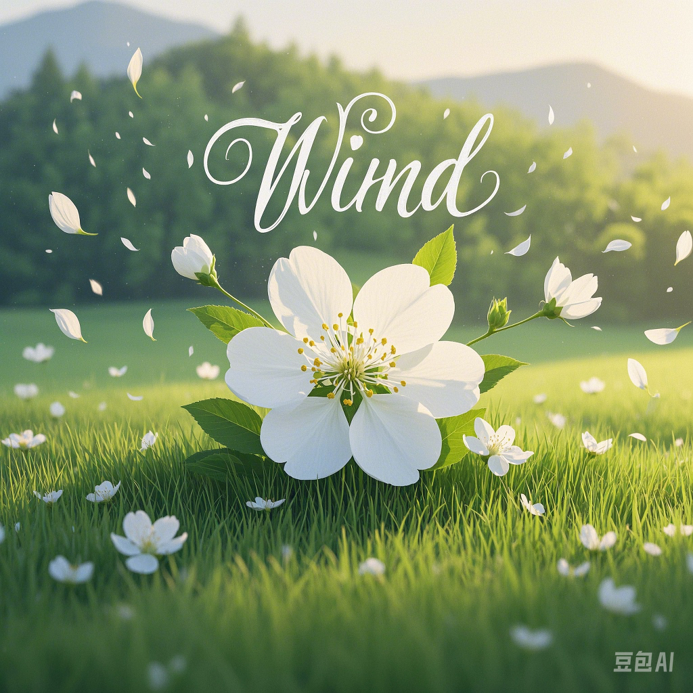

# song-wind
<html lang="en">

<head>
    <meta charset="UTF-8">
    <meta name="viewport" content="width=device-width, initial-scale=1.0">
    <title>音乐播放器</title>
    
</head>

<body>
    

        

            
        

        
Wind

        <button id="play-pause">播放</button>
        

            0:00
            

                

            

            0:00
        

        <audio id="music" src="wind_improved.mp3"></audio>
    

    
</body>

</html>    
